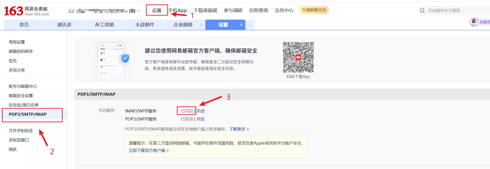

## Springboot 发送邮件
### 第一步 添加依赖
```xml
<dependency>
    <groupId>org.springframework.boot</groupId>
    <artifactId>spring-boot-starter-mail</artifactId>
</dependency>
```

### 第二步 配置信息
在application.yml下添加发送邮件的主体，下面以163邮箱距离
```yaml
spring:
  mail:
    # 163邮箱的地址为smtp.163.com。
    host: smtp.163.com
    # 你申请的163邮箱
    username: xxx@163.com
    # 注意客户端授权密码是在开启smtp/pop3时自动生成的，记得保存一下，不然就找不到了
    password: xxx
```

### 第三步 应用
```java
@RestController
public class EmailController {


    //主要的工具类
    @Autowired
    JavaMailSender sender;

    @GetMapping("/sendEmail")
    public String sendEmail() {
        // 发送邮件的逻辑
        SimpleMailMessage message = new SimpleMailMessage();
        //设置邮件标题
        message.setSubject("email-subject");
        //设置邮件内容
        message.setText("比奇堡海滩邀请您参加2025年度海底灭火行动");
        //邮件接收者
        message.setTo("xxx@qq.com");
        //邮件发送者，这里要与配置文件中的保持一致
        message.setFrom("xxx@163.com");
        sender.send(message);
        return "success";
    }
}
```

### 如何在163邮箱找到自己的客户端授权密码
注意，点击开启后可以看到密码，记得复制后找个地方保存，因为它只出现一次，后面不会再出现。
